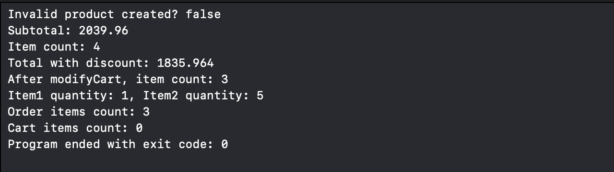

### Why did you choose class for ShoppingCart?

I chose a class for ShoppingCart because it needs reference semantics — when the cart is updated (for example, when adding or removing items), the changes should be visible across all parts of the program that reference the same cart. This behavior makes sense for a shared object like a shopping cart.

---

### Why did you choose struct for Product and Order?

I used structs for Product and Order because they are data models that represent independent pieces of information. Structs use value semantics, meaning each product or order is a separate copy that won’t accidentally change when passed around. This makes the data more predictable and safer to use.

---

### Explain one example where reference semantics matter in your code

Reference semantics matter in ShoppingCart.
For example, if you add an item to the cart in one part of the program, other parts that use the same ShoppingCart instance will automatically see the updated list of items — without needing to copy or reassign the object.

---

### Explain one example where value semantics matter in your code

Value semantics matter in Product.
If you copy a Product and modify its price or name, it won’t affect the original product elsewhere in the program. This prevents unintended side effects and keeps product data consistent.

---

### What challenges did you face and how did you solve them?

One challenge was managing the quantity of items in the cart and preventing invalid values (like zero or negative numbers).
I solved this by adding input validation in the updateQuantity and increaseQuantity methods to ensure only positive values are accepted.

---

### Tests.

